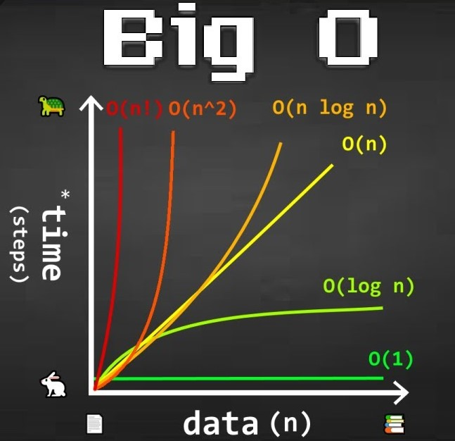

# Sorting Algorithms and Time Complexity

This repository contains implementations of various sorting algorithms in C language using arrays and linked lists

## Directory Files:

|Algorithms|Implementation|Complexity| Array | linked list |Test Files|
|:-|:-:|:-:|:-:|:-:|:-:|
|Bubble Sort|[0-bubble_sort.c](0-bubble_sort.c)|[0-O](0-O)|:heavy_check_mark:||[0-main.c](0-main.c)|
|Insertion Sort|[1-insertion_sort_list.c](1-insertion_sort_list.c)|[1-O](1-O)||:heavy_check_mark:|[1-main.c](1-main.c)|
|Selection Sort|[2-selection_sort.c](2-selection_sort.c)|[2-O](2-O)|:heavy_check_mark:||[2-main.c](2-main.c)|
|Quick Sort|[3-quick_sort.c](3-quick_sort.c)|[3-O](3-O)|:heavy_check_mark:||[3-main.c](3-main.c)|
|Shell Sort|[100-shell_sort.c](100-shell_sort.c)|[100-O](100-O)|:heavy_check_mark:||[100-main.c](100-main.c)|
|Cocktail Sort|[101-cocktail_sort_list.c](101-cocktail_sort_list.c)|[101-O](101-O)||:heavy_check_mark:|[101-main.c](101-main.c)|
|Counting Sort|[102-counting_sort.c](102-counting_sort.c)|[102-O](102-O)|:heavy_check_mark:||[102-main.c](102-main.c)|
|Merge Sort|[103-merge_sort.c](103-merge_sort.c)|[103-O](103-O)|:heavy_check_mark:||[103-main.c](103-main.c)|
|Heap Sort|[104-heap_sort.c](104-heap_sort.c)|[104-O](104-O)|:heavy_check_mark:||[104-main.c](104-main.c)|
|Radix Sort|[105-radix_sort.c](105-radix_sort.c)|[105-O](105-O)|:heavy_check_mark:||[105-main.c](105-main.c)|
|Bitonic Sort|[106-bitonic_sort.c](106-bitonic_sort.c)|[106-O](106-O)|:heavy_check_mark:||[106-main.c](106-main.c)|
|Quick Sortn(Hoares)|[107-quick_sort_hoare.c](107-quick_sort_hoare.c)|[107-O](107-O)|:heavy_check_mark:||[107-main.c](107-main.c)|

#### To Compile a Test Case:

```Bash
gcc print_array.c print_list.c 0-bubble_sort.c test_files/0-main.c -o bubble
```

You can find all tests on [test_files](test_files) and pre-compiled executables of test cases on [output](output)

N.B: the array implementation of the algorithms implemented via linked lists can be found in their respective main test files.


## Big O notation ~ *"how code slows as data grows"*

* Describes the performance of an algorithm as the amount of data increases
* Machine independant
* Ignore smaller operations: O(n + 1) -> O(n), where n = amount of data

<br>

<p align="center" style="font-weight: bold; font-size: 24px">Examples of time complexities</p>

<p align="center"></p>

<br>

## O(1) constant time

This time complexity takes the same amount of time every time now matter how big the data is

Example:

```C
/**
 * sum - sums up all the numbers from [1, n]
 */
int sum(int n)
{
    int sum = n * (n + 1) / 2

    return sum;
}

// if n = 1 000 000 or n = 10
// 3 steps taken always
```

## O (log n) logarithmic time

the rate at which the time complexity increases, decreases as the data grows

Example:

* binary search

## O(n) linear time

This time complexity is dependant of the size of the data and grows linearly as data size increases

Example:

* traversing an array
* searching a linked list

```C
/**
 * sum - sums up all the numbers from [1, n]
 */
int sum(int n)
{
    int sum = 0;
    for (int i = 1; i <= n; i++)
        sum += i;

    return sum;
}
// if n = 1 000 000
// ≈ 1 000 000 steps taken
// if n = 10
// ≈ 10 steps taken
```

## O(n log n) Quasilinear time

time complexity is linear for smaller data sets, but as data set starts to increase

Examples:

* quicksort
* mergesort
* heapsort

## O(n ^ 2) Quadratic time

time complexity accelerates as data set size increase.

Examples:

* bubble sort
* selection sort
* insertion sort

## O(n!) factorial time

time complexity is drastically accelerated with increasing data sets. It is extremely slow

Examples:

* Traveling salesman problem

| Sorting Algorithm      | Best Case Time Complexity | Average Case Time Complexity | Worst Case Time Complexity | Space Complexity |
|------------------------|---------------------------|------------------------------|----------------------------|------------------|
| **Bubble Sort**        | $O(n)$                  | $O(n^2)$                   | $O(n^2)$                 | $O(1)$         |
| **Insertion Sort**     | $O(n)$                  | $O(n^2)$                   | $O(n^2)$                 | $O(1)$         |
| **Selection Sort**     | $O(n^2)$                | $O(n^2)$                   | $O(n^2)$                 | $O(1)$         |
| **Merge Sort**         | $O(n \log n)$           | $O(n \log n)$              | $O(n \log n)$            | $O(n)$         |
| **Quick Sort**         | $O(n \log n)$           | $O(n \log n)$              | $O(n^2)$                 | $O(\log n)$    |
| **Heap Sort**          | $O(n \log n)$           | $O(n \log n)$              | $O(n \log n)$            | $O(1)$         |
| **Shell Sort**         | $O(n \log^2 n)$         | $O(n \log^2 n)$            | $O(n \log^2 n)$          | $O(1)$         |
| **Counting Sort**      | $O(n + k)$              | $O(n + k)$                 | $O(n + k)$               | $O(k)$         |
| **Radix Sort**         | $O(nk)$                 | $O(nk)$                    | $O(nk)$                  | $O(n + k)$     |
| **Bucket Sort**        | $O(n + k)$              | $O(n + k)$                 | $O(n^2)$                 | $O(n)$         |
| **Cocktail Shaker Sort** | $O(n)$                | $O(n^2)$                   | $O(n^2)$                 | $O(1)$         |
